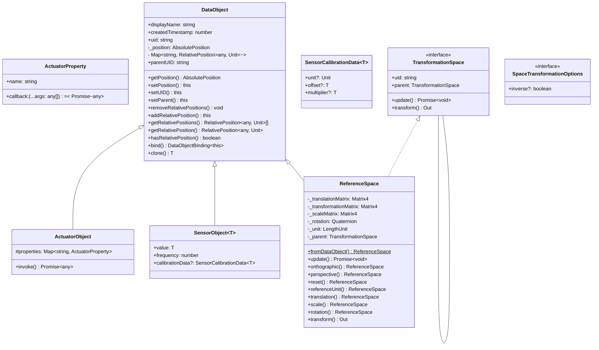

<h1 align="center">
  <br />
  @openhps/core
</h1>
<p align="center">
    <a href="https://github.com/OpenHPS/openhps-core/actions/workflows/main.yml" target="_blank">
        
    </a>
    <a href="https://badge.fury.io/js/@openhps%2Fcore">
        
    </a>
    <a href="https://www.typescriptlang.org/" target="_blank">
        
    </a>
    <a href="https://opensource.org/licenses/Apache-2.0" target="_blank">
        
    </a>
    <a href="mailto:info@openhps.org" target="_blank">
        
    </a>
</p>

<h3 align="center">
    <a href="https://openhps.org/docs/getting-started">Getting Started</a> &mdash; <a href="https://openhps.org/docs/examples">Examples</a> &mdash; <a href="https://openhps.org/docs/core">API</a>
</h3>

<br />

This repository contains the core component for OpenHPS (Open Source Hybrid Positioning System). It includes concepts for creating the model, nodes and data object definitions. The core component acts as the main repository for OpenHPS. However, additional modules expand OpenHPS with additional data storage techniques, positioning algorithms and enable the interoperability of the data produced by systems created with OpenHPS.

OpenHPS is a data processing positioning framework. It is designed to support many different use cases ranging from simple positioning such as detecting the position of a pawn on a chessboard using RFID, to indoor positioning methods using multiple cameras.

## Features
- 2D, 3D and Geographical positioning.
- Relative positioning.
- Basic positioning algorithms (e.g. trilateration, triangulation, fingerprinting, dead reckoning...)
- Advanced positioning algorithms (e.g. computer vision through @openhps/opencv)
- Extremely extensible.
- Open source.

## Add-ons
### Positioning Algorithms
- **[@openhps/imu](https://github.com/OpenHPS/openhps-imu)** - Adds IMU processing nodes for fusing IMU sensors.
- **[@openhps/rf](https://github.com/OpenHPS/openhps-rf)** - Adds RF processing nodes and data objects.
- **[@openhps/fingerprinting](https://github.com/OpenHPS/openhps-fingerprinting)** - Adds various fingerprinting nodes and services for offline and offline positioning models.
- **[@openhps/video](https://github.com/OpenHPS/openhps-video)** - Provides general data objects and data frames for working with images, video data or cameras.
- **[@openhps/opencv](https://github.com/OpenHPS/openhps-opencv)** - Provides linkage with opencv4nodejs and OpenCV.js for computer vision algorithms on the server or browser.
- **[@openhps/openvslam](https://github.com/OpenHPS/openhps-openvslam)** - Provides bindings to OpenVSLAM
- **[@openhps/orb-slam3](https://github.com/OpenHPS/openhps-orb-slam3)** - Provides bindings to ORB-SLAM3

### Abstractions
- **[@openhps/geospatial](https://github.com/OpenHPS/openhps-geospatial)** - Enables the concept of geospatial spaces (e.g. building, room) on top of reference spaces.

### Data Services
- **[@openhps/mongodb](https://github.com/OpenHPS/openhps-mongodb)** - Adds MongoDB support for the storage of data objects.
- **[@openhps/localstorage](https://github.com/OpenHPS/openhps-localstorage)** - Basic persistent storage for browser based models.
- **[@openhps/rdf](https://github.com/OpenHPS/openhps-rdf)** - RDF exporting of data objects and data frames.
- **[@openhps/solid](https://github.com/OpenHPS/openhps-solid)** - Solid Pods as data storage for data objects.

### Communication
- **[@openhps/socket](https://github.com/OpenHPS/openhps-socket)** - Provides node communication through Socket.IO for remote models.
- **[@openhps/rest](https://github.com/OpenHPS/openhps-rest)** - Provides node communication through restful endpoints.
- **[@openhps/mqtt](https://github.com/OpenHPS/openhps-mqtt)** - MQTT client node communication and standalone MQTT server.

### Smartphone
- **[@openhps/react-native](https://github.com/OpenHPS/openhps-react-native)** - Provides nodes for retrieving sensor data in react-native.
- **[@openhps/nativescript](https://github.com/OpenHPS/openhps-nativescript)** - Provides nodes for retrieving sensor data in NativeScript.
- **[@openhps/cordova](https://github.com/OpenHPS/openhps-cordova)** - Provides nodes for retrieving sensor data in Cordova/Phonegap.
- **[@openhps/capacitor](https://github.com/OpenHPS/openhps-capacitor)** - Provides nodes for retrieving sensor data in Ionic Capacitor.

### Misc
- **[@openhps/sphero](https://github.com/OpenHPS/openhps-sphero)** - Example implementation for controlling and receiving sensor data from Sphero toys.
- **[@openhps/csv](https://github.com/OpenHPS/openhps-csv)** - Read and write data frames from/to CSV files.
- **[@openhps/dht](https://github.com/OpenHPS/openhps-dht)** - Distributed hash tables for discovering positioning systems based on a rough geographical location.

## Getting Started
If you have [npm installed](https://www.npmjs.com/get-npm), start using @openhps/core with the following command.
```bash
npm install @openhps/core --save
```

The core idea and goals of OpenHPS are outlined in the technical paper: [*OpenHPS: An Open Source Hybrid Positioning System*](https://openhps.org/publications/2020/techreport/).

## Usage
OpenHPS uses a process network to create a positioning system. This process network is created using the `ModelBuilder`. Every model starts with the creation
of a new model that starts `from` a source node and passed `via` a set of processing nodes until it arrives `to` a sink node.

```typescript
import { ModelBuilder } from '@openhps/core';

ModelBuilder.create()
    .from(/* ... */)
    .via(/* ... */)
    .to(/* ... */)
    .build().then(model => {
         // ...
    });
```

### Browser
- `openhps-core.js`: UMD
- `openhps-core.es.js`: ES6 import
- `worker.openhps-core.js`: UMD worker
- `openhps-core-lite.js`: UMD lite version for embedded systems

## Documentation
The documentation for OpenHPS can be found [online](https://openhps.org) on the website.

### JOSS Paper
The JOSS paper can be found here: `/docs/paper/paper.md`.

### Publications
Please check [https://openhps.org/publications/](https://openhps.org/publications/) for more information.

### Data Objects


## Contributing
Use of OpenHPS, contributions and feedback is highly appreciated. Please read our [contributing guidelines](CONTRIBUTING.md) for more information.

## License
Copyright (C) 2019-2025 Maxim Van de Wynckel & Vrije Universiteit Brussel

Licensed under the Apache License, Version 2.0 (the "License"); you may not use this file except in compliance with the License. You may obtain a copy of the License at

https://www.apache.org/licenses/LICENSE-2.0

Unless required by applicable law or agreed to in writing, software distributed under the License is distributed on an "AS IS" BASIS, WITHOUT WARRANTIES OR CONDITIONS OF ANY KIND, either express or implied. See the License for the specific language governing permissions and limitations under the License.