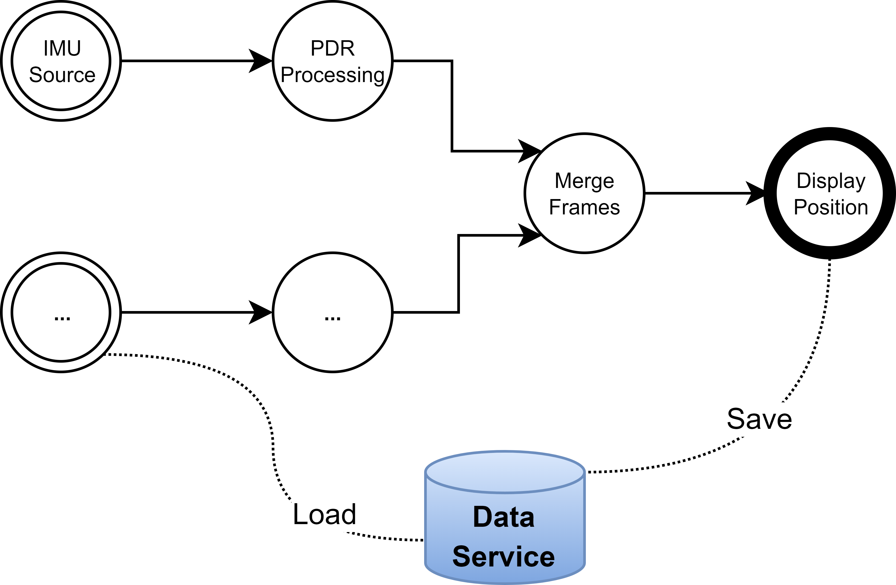

## Abstract
Positioning systems determine the location of people and objects using various technologies and algorithms. While GPS dominates outdoor positioning, indoor and smaller-scale systems often require alternative technologies for improved latency, accuracy, or efficiency. These systems are frequently developed as single-use prototypes with no standard data format, hindering replication and expansion. OpenHPS addresses these challenges by providing a modular, graph-based framework for creating versatile positioning systems. It supports a wide range of algorithms and allows developers to extend functionality by sharing custom *nodes* for sensor fusion and novel algorithms.

## Keywords
hybrid positioning systems, interoperable positioning systems, indoor positioning, stream processing, RDF

# Statement of Need
Existing positioning systems or frameworks such as AnyPlace [@georgiou2015anyplace] focus on a specific use case, platform or set of algorithms. While this facilitates the development of a positioning system, it also limits the freedom to design custom algorithms or positioning systems. In systems developed for academic purposes, proprietary systems are created that are difficult to replicate, expand or implement in a production-ready environment due to the use of software such as MatLab. OpenHPS was created to address these issues by providing a modular framework that allows developers and researchers to create positioning systems for a wide range of use cases. The framework and positioning systems created with our framework are designed to be interoperable, allowing developers to share their algorithms and positioning systems with others. Using additional modules that add support for Solid [@vandewynckel2022] and DHT, we have enabled the development of findable, accessible, interoperable and reusable (FAIR) positioning systems.

## Framework Overview
`OpenHPS` is an open source hybrid positioning system framework written in TypeScript. It can be run on the server using NodeJS, the browser or even hybrid mobile applications such as NativeScript, React-Native and CapacitorJS. The general design of a positioning system created using our framework consists of a graph with a set of nodes that process data. Background services can be added to the graph to persist data or to communicate with other systems.

All concepts, ranging from positions to sensor values can be expressed in various ways with varying units, allowing OpenHPS to be used for small scale use cases such as tracking a pen on a paper to larger use cases such as tracking airplanes across the globe. Our framework uses stream based processing of `DataFrame`s which contain all time-sensitive information. Inside these frames can be one or more `DataObject`s which indicate the spatial objects that are relevant for the information within the data frame.

{width=60%}

Both this information can be serialised to JSON or RDF data using the POSO ontology [@vandewynckel2022iswc], enabling the interoperability between systems. Each node in the graph represent a step in the processing of data frames from source to sink as shown in Figure 1. A `SourceNode` generates information, a `ProcessingNode` processes information and a `SinkNode` consumes information.

OpenHPS is modular by design, mainly due to the ability to extend data frames and objects. These extensions allow for different data objects such as different sensors such as cameras, IMU sensors or spatial landmarks such as Bluetooth beacons. Each node in a graph can be extended as well, allowing the creation of custom algorithms that can be added or removed from a positioning system with ease. Researchers can focus on the prototyping of new algorithms without having to worry about the integration of these algorithms into a larger system.

### Interoperability
Our framework is designed to offer FAIR positioning systems, both using the open approach of the framework as well as the data these systems produce. With our modules such as `@openhps/rdf` and `@openhps/solid` we have enabled developers to serialise their data to RDF and store it in Solid Pods. This allows for the creation of positioning systems that are transparent and privacy preserving, while also ensuring that other positioning systems or consumer applications can access the data regardless if they are created using OpenHPS. Extensions such as `@sembeacon/openhps` provide support for semantic beacons [@vandewynckel2023] that can enable the discovery (i.e., findability) of these systems and the data they produce. 

### Performance
Since our framework uses TypeScript, it uses JavaScript at runtime, which is single-threaded by default. To overcome the challenges associated with this when creating real-time stream processing systems, our graphs or portions of the graph can be executed with the help of web workers. All data transmitted through our graph is serialisable, which prevents the need for developers to handle this serialisation or the communication between web workers themselves.

In addition to the ability to run graphs on multiple workers, our communication nodes such as MQTT, combined with the serialisability of data, allows developers to offload the processing of complicated tasks to other servers or dedicated processors. For more high-demanding algorithms such as computer vision and visual SLAM, modules such as `@openhps/opencv` and `@openhps/openvslam` create C++ bindings in NodeJS.

# Examples of Research Work
OpenHPS has been a building block for various research such as its use within indoor positioning systems [@vandewynckel2021], its ability to serialise location data to RDF in a demonstrator application that aims to preserve privacy and transparency using Solid-pods [@vandewynckel2022] and its use within the SemBeacon demonstrator application [@vandewynckel2023] that is written in CapacitorJS and uses OpenHPS to deserialise positioning data and positioning systems. Modules have been created for other academic projects such as the FidMark [@vandewynckel2024] ontology that provides fiducial marker classification within the framework. The ability for OpenHPS to contain modular nodes and its use within the domain of positioning systems can allow for easier sharing of algorithms and findings, as well as the rapid creation of prototypes and demonstrators that make use of location data. Finally, OpenHPS and the related modules have been used to collect several datasets that can be used by researchers to evaluate their algorithms [@openhps2021dataset], [@maxim_van_de_wynckel_2025], [@maxim_van_de_wynckel_beat_signer_2025]. 

# References
